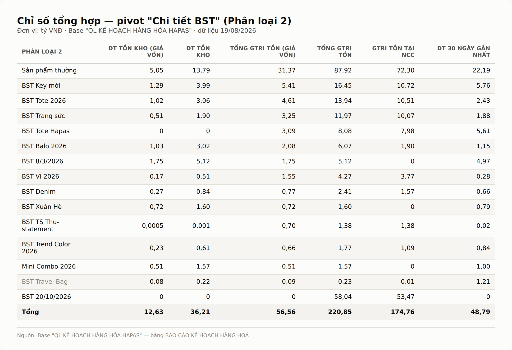
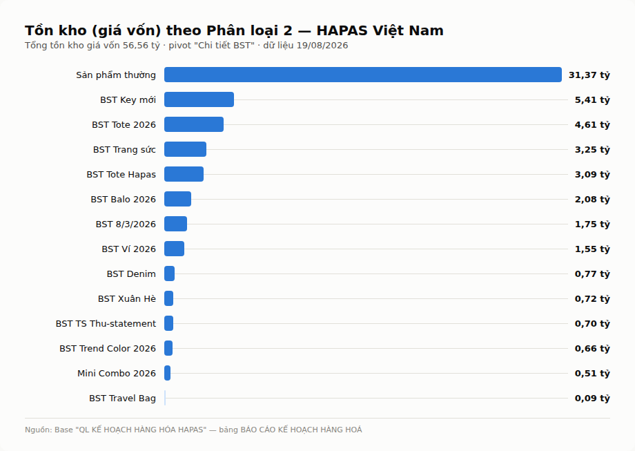

# BÁO CÁO KHHH HAPAS VIETNAM

## 19/08/2026

### Tổng quan

**TỔNG QUAN**
- Tồn kho hiện tại (giá vốn, theo pivot "Chi tiết BST"): 56,56 tỷ
- Doanh thu 30 ngày gần nhất (toàn bộ): 48,79 tỷ
- BST tồn cao nhất: Sản phẩm thường 31,37 tỷ (55,5% tổng tồn) → BST Key mới 5,41 tỷ → BST Tote 2026 4,61 tỷ → BST Trang sức 3,25 tỷ → BST Tote Hapas 3,09 tỷ
- BST Travel Bag: tồn giá vốn chỉ còn 86,4 triệu => coi như đã bán sạch sau dự án, khớp với thông tin "đã kết thúc dự án" ở nhóm chat
- BST 20/10/2026: 0 tồn/0 doanh thu, nhưng Gtri tồn tại NCC đã 53,47 tỷ => hàng đang nằm ở NCC chờ về, chưa lên hệ thống

**VỀ CÁC DỰ ÁN**
- **Travel Bag**: sự cố BLG giảm 6% do giá vốn bị điều chỉnh mà team dự án không được báo trước → đã tăng giá bán lên 1.283k từ 12h 30/7, BLG sau thuế tăng lên ~61%
- **Trang sức (PTSP)**: online tháng 8 dự kiến chỉ đạt 3 tỷ, hụt 3,5 tỷ so target 6,5 tỷ → điều chỉnh target còn 4,5 tỷ, KHHH cam kết kéo hàng combo best-seller 300tr (15/8) + 500tr (20/8) để bù → họp 19/08 Retail trình kế hoạch mở rộng bán Trang sức toàn hệ thống đến cuối 2026
- **Nước hoa (PTSP)**: target KD tháng 8+9 ~4,5 tỷ, hàng sắp về chỉ 2,8 tỷ → hụt 1,7 tỷ, cần đặt thêm ~2,8 tỷ do MOQ NVL 3.000 → họp 20/08 R&D reconfirm target và rủi ro đóng gói combo 20/10
- **BST Da Loang** (launching 15/9): chỉ 2 mã, đang đặt 300sp/mã → lo ngại thiếu hàng, đã đề xuất lùi launching / check lại lead time thực tế

### Chỉ số tổng hợp — bảng Báo cáo KHHH, pivot "Chi tiết BST" (Phân loại 2)

*Sản phẩm thường chiếm 55,5% tổng tồn kho giá vốn (31,37 tỷ/56,56 tỷ) => đây là nhóm cần theo dõi sát nhất về tốc độ bán, không phải BST launching mới. BST Travel Bag gần như hết tồn (86,4 triệu) — khớp với thông tin dự án đã kết thúc.*

*(Chỉ số bổ sung ngoài pivot — tính trên toàn bộ 329 SKU của bảng: Doanh thu MTD 51,80 tỷ, giá trị hàng nhập trong tháng 135,77 tỷ, tổng số lượng tồn kho 242.828 sp, số lượng đang trên đường 8.173 sp, giá bán TB/SKU 1.050.095đ, giá vốn TB/SKU 356.724đ.)*

### Chi tiết theo từng bộ sưu tập

- **BST Denim 2026**: họp tổng kết dự án dời sang tuần sau, do ~80% nhân sự Denim đang bị điều sang chạy gấp BST Balo + Tote (truyền thông mới chỉ trong 2 ngày). Chưa có số liệu mới về đơn hàng/tồn kho denim kỳ này.
- **BST Tote/Balo 2026**: đang được ưu tiên nguồn lực gấp cho truyền thông mới (kéo nhân sự từ Denim sang) — cần theo dõi tiến độ đặt hàng tuần tới.
- **Nhập hàng Thái Lan**: 2 lô nhập kho 8/7 và 16/7, số lượng khớp 100% với số lượng gửi, không phát sinh chênh lệch SKU.
- **Đặt hàng theo lead time**: lead time tối thiểu 35 ngày + 7-10 ngày thu thập data bán → cần mở bán ≥45 ngày trước launching để tránh launching mà không có hàng. Đã chốt mốc: Thu Đông hạ đơn SKU cuối 25/8; Tweed (lead time ~60 ngày) hạ đơn SKU cuối 1/9.
- **Target DA tháng 10**: sau tranh luận số liệu doanh thu online (284/315 tỷ vs 320/350 tỷ), đã chốt target 350 tỷ tại họp Review + Đồng thuận doanh thu/SP Quý 3+4 (6/8).
- **Trang sức HAPAS**: task mới chốt 6/8 — mục tiêu lên TOP 1 sàn TMĐT vào tháng 6/2027.
- **Đóng gói**: cập nhật hình ảnh đóng gói tự động cho Hộp Dịu Dàng, Hộp Chân Thành (BST 20/10/2026) và Kery/Ariel/Siena/Kera/Roam Tote Bag (BST Tote 2026) — không phát sinh vấn đề.

### Demand and supply

**Bán lẻ**
- Target Tote bán lẻ tháng 8 bị điều chỉnh giảm từ 400 xuống 300 sp/mã → cần check khả thi theo lịch hàng về, tồn kho hiện tại và số bán lẻ được chia
- Tháng 9: bán lẻ đề xuất doanh thu 1,2 tỷ cho Tote → cần rà soát hàng hoá có đủ đáp ứng demand không
- Điều chuyển hàng hoá tuần 1/8: mã dự phóng 1-5sp chuyển 100% số lượng, mã >5sp chuyển 50%
- Team Retail báo cáo nhiều SP tồn lâu, đang lên kế hoạch Clear, nhờ KHHH review → đồng thời có bất đồng số liệu plan tháng 8 giữa KHHH và Bán lẻ, cần chốt lại phương án hàng hoá chung

**Supply**
- Đơn hàng nước hoa cần bổ sung ~2,8 tỷ để bù hụt target T8+9 (MOQ NVL 3.000)
- Denim: nguồn lực đặt hàng đang bị pha loãng do ưu tiên Balo/Tote — cần theo dõi có ảnh hưởng tiến độ đặt hàng Denim hay không
- BST Da Loang: 300sp/mã x 2 mã trước launching 15/9 — số lượng đặt có vẻ mỏng so với 1 BST launching mới, cần đối chiếu lại forecast bán trước khi chốt

### Sự cố trong tuần, bài học, tại sao lại có, nếu làm lại thì làm gì?

- **Travel Bag — BLG giảm 6%**: giá vốn bị kế toán/CĐS điều chỉnh trên hệ thống mà không thông báo trước cho team dự án/PM, chỉ phát hiện khi đã bán được 1 thời gian, ảnh hưởng BLG/LNĐG các team KD 1-3% trong tháng 7 → nếu làm lại: mọi thay đổi giá vốn phải thông báo cho team dự án TRƯỚC khi áp dụng lên hệ thống, không phải sau khi phát hiện lệch số.
- **Trang sức — hụt target 3,5 tỷ**: target 6,5 tỷ chốt đầu tháng không được review sát theo tuần, đến giữa tháng mới phát hiện gap lớn → nếu làm lại: review target theo tuần thay vì chỉ chốt 1 lần đầu tháng, đặc biệt với BST đang trong giai đoạn launching/rủi ro cao.
- **BST Da Loang — đặt hàng mỏng trước launching**: chỉ 300sp/mã cho 2 mã, launching 15/9 đã cận kề → nếu làm lại: chốt lead time thực tế trước khi set ngày launching, không set ngày rồi mới đối chiếu lead time.

**Câu hỏi cần chốt tuần này:**
- Trang sức: kế hoạch mở rộng bán toàn hệ thống của Retail (họp 19/08) có ăn khớp với target 4,5 tỷ đã hạ không, hay lại phải điều chỉnh tiếp?
- Da Loang: có lùi launching 15/9 hay giữ nguyên và chấp nhận rủi ro thiếu hàng?
- Bán lẻ vs KHHH: bất đồng số liệu plan tháng 8 — ai chốt bản cuối, khi nào?

---
*Tự động tổng hợp từ: Base "QL KẾ HOẠCH HÀNG HÓA HAPAS" (bảng BÁO CÁO KẾ HOẠCH HÀNG HOÁ) + các nhóm chat dự án HAPAS hoạt động trong 19/07–19/08/2026. Tham khảo cấu trúc theo báo cáo mẫu "03. BÁO CÁO PLANNING" (bản 16/08/2026).*
