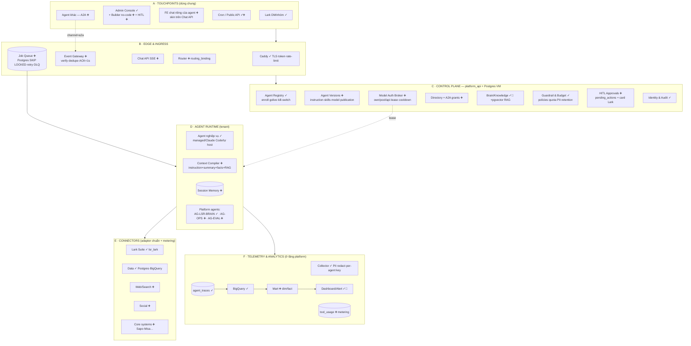
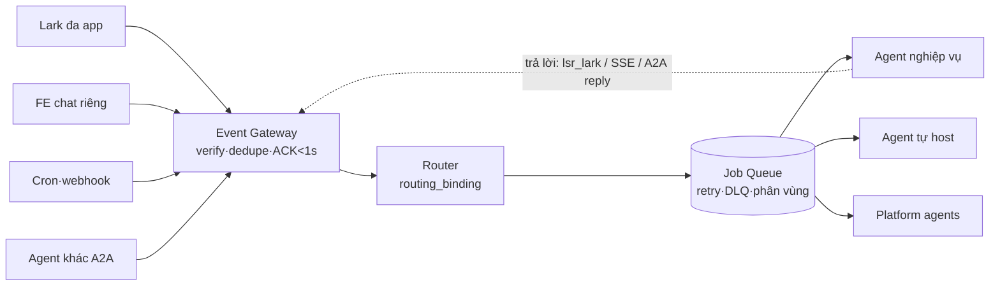
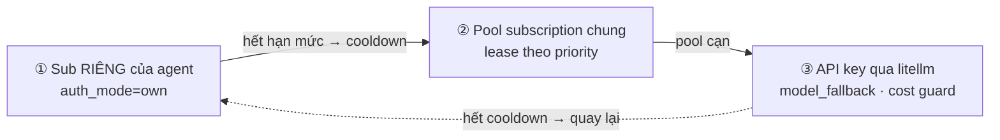

# LSR Agent Platform — Kiến trúc v3

> Bản chốt 2026-08-11, sau khi kiểm tra 7 use case và điều chỉnh.
> Plan triển khai chi tiết (7 phase + test case): [PLAN.md](../PLAN.md).
> Bản trình bày trực quan (SVG, bảng phân tích): artifact "Kiến trúc v3 + Plan chi tiết".

## Nguyên tắc

1. **Mọi thứ dùng chung nằm ở platform** — touchpoint, connector, event collector/audit,
   control plane. Một agent chỉ sở hữu: danh tính, instruction/version, brain & policy
   scope riêng, front-end tuỳ chọn.
2. **Agent là tenant** — agent nghiệp vụ (Minh Anh, Nga BI, Jenny…) và platform agent
   (AG-LSR-BRAIN, AG-OPS, AG-EVAL) đều chạy trên cùng khuôn, ăn chung telemetry/quota/audit.
3. **Không re-platform** — giữ VM + Postgres + FastAPI + Caddy + Next.js đang chạy;
   khái niệm mới (gateway, queue, versions…) đặt lên hạ tầng sẵn có.
4. **State ở platform, không ở model** — mỗi call LLM là stateless, context được compile
   từ Postgres. Nhờ đó đổi credential/model giữa chừng không mất ngữ cảnh.
5. **Secrets chỉ ở VM** (`/opt/lsr-platform/.env`, `/opt/lsr-platform/secrets/`) — DB và
   git chỉ giữ tham chiếu. Không bao giờ commit secret.

## Sơ đồ tổng thể — 7 tầng

Trạng thái: ✓ đang chạy · 🔶 nâng cấp · ➕ mới (trong plan).

## Đánh giá 7 use case → điều chỉnh

| # | Use case | Trước v3 | Điều chỉnh |
|---|---|---|---|
| 1 | Agent mới qua code, FE chat riêng nhưng trong luồng chung | Một phần | **Chat API (SSE)** tại gateway — FE riêng là "skin", mọi tin đi gateway→queue→agent → tự có telemetry/quota/kill-switch. FE không gọi thẳng runtime. |
| 2 | Skill mới chưa có ở agent nào — log/chi phí/hiệu quả | Một phần (trace chỉ đếm tổng tool_calls) | Skill khai báo trong `agent_versions.skills`; **`tool_usage`** metering từng call; mart thêm chiều skill/tool. |
| 3 | Từng agent dùng subscription riêng | **Chưa** (runner hard-wire token owner) | **Model Auth Broker**: `model_credentials` (secret_ref → file VM) + `agents.auth_mode=own\|pool\|api`; runner *lease* khi chạy. |
| 4 | Hết token → tự chuyển subscription | **Chưa** | **Pool + cooldown 5h + failover** tự động; alert khi pool cạn. |
| 5 | Context đủ mỗi call, không lưu ở model; hết sub mới dùng API + chọn model | Một phần | **Context Compiler** (stateless, state ở Postgres) + **ladder** own→pool→API qua litellm (`model_fallback`, cost thật). |
| 6 | Agents quản platform, phối hợp human | Một phần | **HITL Approvals** (`pending_actions` + card Lark); risk thấp auto, cao phải duyệt; proposer ≠ approver; AG-OPS điều phối tải. |
| 7 | Agent thấy nhau, gọi nhau không qua FE | **Chưa** | **Directory** + **A2A** qua chính job queue (channel=a2a), `a2a_grants`, hop-limit ≤3, caller-pays, audit 2 chiều. |

## Hai cơ chế lõi

### Đồng bộ touchpoint (UC1·UC7)

- Mọi kênh (kể cả agent-gọi-agent, FE riêng) chỉ là **nguồn sự kiện** vào một cổng —
  thêm kênh/agent không đổi phần sau (1 dòng `routing_binding`).
- Queue trên Postgres sẵn có (`FOR UPDATE SKIP LOCKED`), retry backoff 2^n, DLQ + replay.

### Model auth ladder (UC3·4·5)

- Runner không giữ token cứng: `POST /v1/self/model-auth/lease` khi start và khi gặp limit.
- 429/limit → `report` → credential vào cooldown (cửa sổ 5h) → lease account kế tiếp → retry job.
- API chỉ dùng khi **mọi** subscription cooldown; bắt buộc qua litellm để đo chi phí thật.
- Kết hợp Context Compiler: đổi account/model giữa hội thoại **không mất ngữ cảnh**.

## Kiến trúc bên trong 1 agent

Một agent sở hữu: **① danh tính** (agent_id, owner, telemetry key, auth_mode) ·
**② runtime** (managed agent_runner / Claude Code + plugin / bot tự host) ·
**③ brain riêng** (scope=agent + đọc shared) · **④ policy scope riêng** ·
**⑤ FE/BE tuỳ chọn** (Vercel owner, chat qua Chat API). Mọi thứ khác mượn từ core qua
endpoint chuẩn: `/v1/traces`, `/v1/policy/check`, `/v1/self*`, `/v1/lark/*`,
`/v1/self/jobs`, `/v1/self/model-auth/*`, `/v1/self/a2a/*`, `/v1/self/directory`.

## Quyết định giữ / bỏ (đối chiếu kiến trúc tham khảo)

- **Dùng**: Event Gateway + routing_binding + queue · agent_versions + instruction_block +
  publication dev/stg/prod · Connector Registry · pgvector RAG · eval gate trước publish ·
  mart star-schema · memory service.
- **Chỉnh**: queue = Postgres sẵn có (không pg-boss/QStash) · control plane = Postgres VM
  (không Supabase) · orchestrator/sandbox = Claude Agent SDK + container per-agent
  (không tự build) · model router = agent_versions.model + litellm.
- **Bỏ**: tRPC · edge Vercel (Caddy đã lo; Vercel owner chỉ FE/BE agent) · Hermes fallback.

## Ràng buộc chuẩn (cập nhật)

- **Auth model**: subscription ladder **sub riêng → pool → API (litellm)**
  (thay quy ước cũ "chỉ subscription owner"). Secrets chỉ ở VM.
- Deactive **không xoá dữ liệu** (403 collector + gỡ bot Lark + dừng container).
- Non-maintainer chỉ sửa phần agent (scope-guard + CODEOWNERS).
- Mọi agent bắt buộc đổ telemetry về collector; PII redact trước khi ghi.
- Platform agent không tự approve hành động của chính mình (separation of duty).
